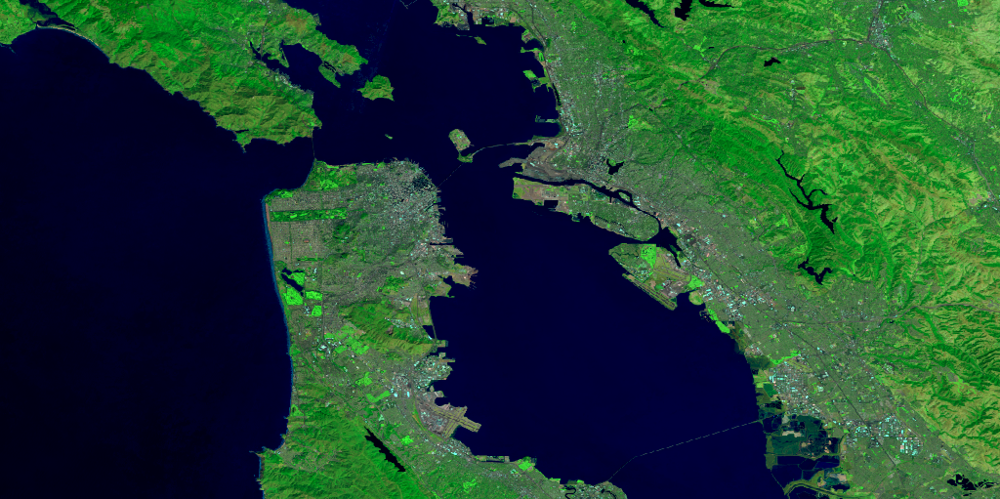
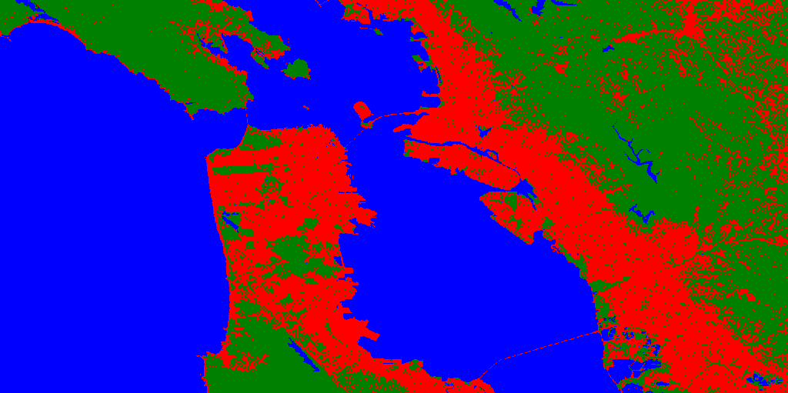

# Classification

This example highlights how the EE Julia API can be used to sample data and classify an image. Example from the [Supervised Classification guide](https://developers.google.com/earth-engine/guides/classification#code-editor-javascript).

## Code

```julia
using EarthEngine
Initialize()

# Make a cloud-free Landsat 8 TOA composite (from raw imagery).
l8 = filterDate(
  EE.ImageCollection("LANDSAT/LC08/C01/T1"),
  "2018-01-01", "2018-12-31"
)
image = simpleComposite(l8; asFloat=true)

# Use these bands for prediction.
bands = EE.List(["B2", "B3", "B4", "B5", "B6", "B7", "B10", "B11"])

# Load training points. The numeric property 'class' stores known labels.
points = EE.FeatureCollection("GOOGLE/EE/DEMOS/demo_landcover_labels")

# This property stores the land cover labels as consecutive
# integers starting from zero.
label = "landcover"

# Overlay the points on the imagery to get training data
training = sampleRegions(
  select(image, bands);
  collection = points,
  properties = [label],
  scale = 30
)

# Train a CART classifier with default parameters.
model = train(smileCart(), training, label, bands)

# Classify the image
classified = classify(image, model)

# define a region to view results
region = bounds(buffer(points, 5000))

# Display the inputs and the results.
imgthumb = getThumbURL(image, Dict(
  :bands => "B7,B5,B3",
  :min => 0.05,
  :max => 0.55,
  :gamma => 1.5,
  :region => region,
  :dimensions => 1024
))

classificationthumb = getThumbURL(classified, Dict(
  :min => 0,
  :max => 2,
  :palette => "red, green, blue",
  :region => region,
  :dimensions => 1024
))
```

## Expected result

| Landsat Image   | Classified Image |
| :---        |    ----:   |
|  |  |
