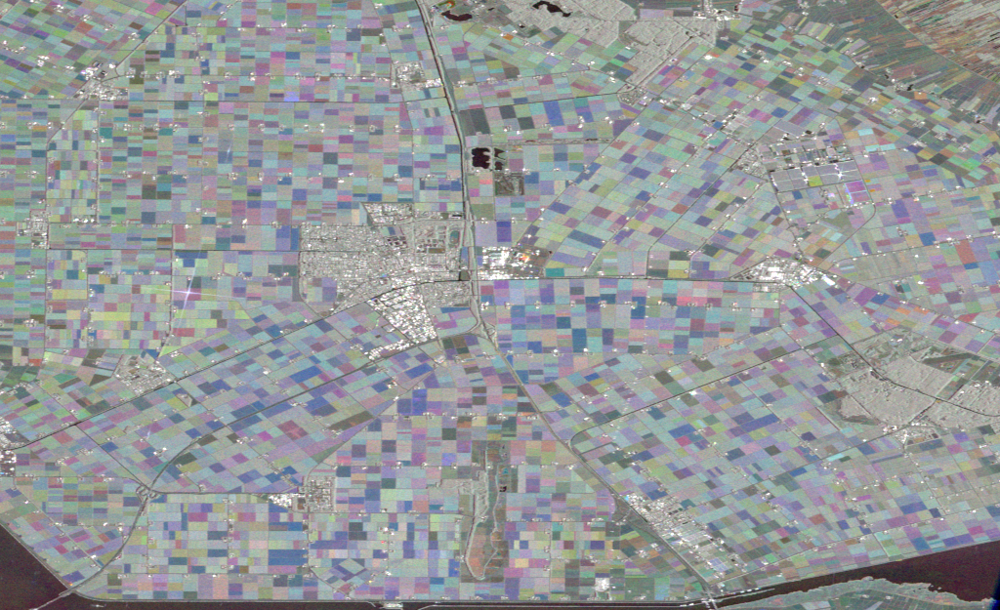

# Sentinel1 Composite

This example highlights how the EE Julia API can be used to process Sentinel 1 imagery and create a temporal mosiac. Example from the [Javascript Sentinel1 Composite example](https://code.earthengine.google.com/?scriptPath=Examples:Demos/Sentinel1%20Composite).

## Code

```julia
using EarthEngine
Initialize()

# define S1 image collection
collection = EE.ImageCollection("COPERNICUS/S1_GRD")

# define a filter to select specific data from collection
# filter by instrument mode
# filter by specific band
# fitler by orbit property
datafilter = And(
    eq(EE.Filter(), "instrumentMode", "IW"),
    listContains("transmitterReceiverPolarisation", "VV"),
    eq(EE.Filter(), "orbitProperties_pass", "DESCENDING"),
)

# apply filters to image collection
filtered = select(filter(collection,datafilter),["VV"])

# calculate mean composites for three different date ranges
r = mean(filterDate(filtered,"2016-04-01", "2016-05-30"))
g = mean(filterDate(filtered,"2016-06-01", "2016-08-31"))
b = mean(filterDate(filtered,"2016-09-01", "2016-11-30"))

# combine the three images into one rgb composite
composite = cat(EE.Image(),[r,g,b])

# define a region to view results
geometry = Point(5.7788, 52.7005)
region = bounds(buffer(geometry,10000))

# get a link to view results
getThumbURL(composite, Dict(
    :min => -25,
    :max => 0,
    :region => region,
    :dimensions => 1024,
))
```

## Expected result


